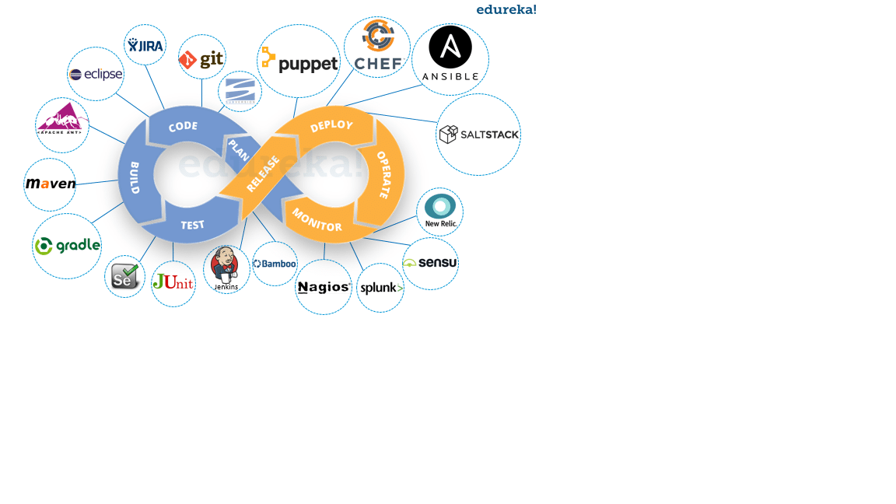
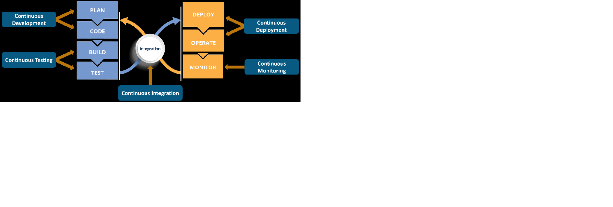

## 
To achieve faster application delivery, the right tools must be used in DevOps environments. There is no single tool that fits all your needs such as server provisioning, configuration management, automated builds, code deployments, and monitoring. Many factors determine the use of a particular tool in your infrastructure.

### DevOps Tools for Infrastructure Automation
There are many tools available for infrastructure automation. Which tool to be used is decided by the architecture and needs of your infrastructure. Below are few great tools which come under various categories like configuration management, orchestration, continuous integration, monitoring, etc,

## 

1. Infrastructure as Code
2. Continuous Integration/Deployment
3. Config/Secret Management
4. Monitoring

#### Infrastructure as Code
1. Terraform
2. Ansible
3. Chef
4. Puppet

#### Continuous Integration/Deployment
1. Jenkins (CI/CD pipeline)
2. Docker (Container)
3. Kubernetes (It’s a container orchestration platform that takes containerization to the next level)

### Config/Secret Management
1. Consul
2. Vault (Storing and retrieving secret data)
3. etcd

### Monitoring
1. Prometheus & Alert Manager
2. ELK Stack (Kibana, Elastic Search, Logstash, FileBeat & MetricBeat)
3. Sensu (Servers monitoring)

### Reference
1. https://docs.microsoft.com/en-us/azure/devops/learn/what-is-devops
2. https://dzone.com/articles/infrastructure-as-code-a-devops-way-to-manage-it-i
