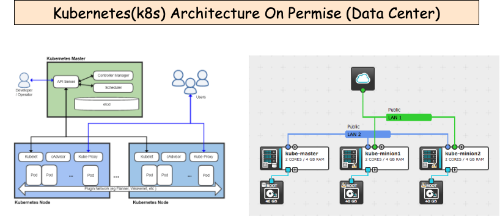
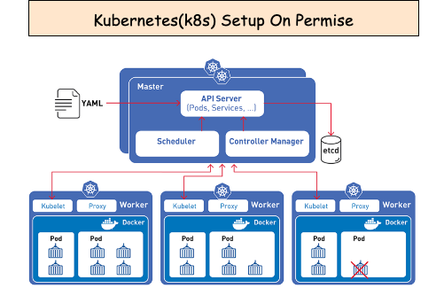
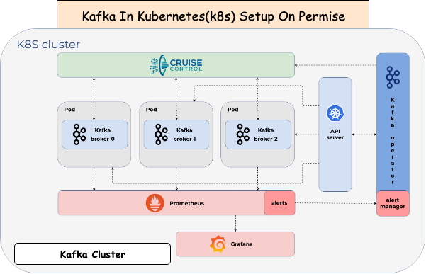

## Tool For Infrastructure Setup
To achieve faster application delivery, the right tools must be used in DevOps environments. This is detail level architecture to setup
cloud-native experience or set your organization up to be cloud-agnostic.

## 

## Steps to setup K8s on premise (Data Center)
Kubernetes provides a platform to configure, automate, and manage:

1. intelligent and balanced scheduling of containers
2. creation, deletion, and movement of containers
3. easy scaling of containers
4. monitoring and self-healing abilities

A Kubernetes cluster is comprised of at least one master node, which manages the cluster, and multiple worker nodes, where containerized applications run using Pods. A Pod is a logical grouping of one or more containers, which are scheduled together and share resources. Pods enable multiple containers to run on a host machine and share resources, such as: storage, networking, and container runtime information.
## 

The Master node manages the cluster in this way:

- The API server parses the YAML configuration and stores the configuration in the etcd key value store.
- The etcd stores and replicates the current configuration and run state of the cluster.
- The scheduler schedules pods on worker nodes.
- The controller manager manages the state of non-terminating control loops, such as pod replicas.

The microservice architectural style is an approach to developing an application as a suite of small independently deployable services built around specific business capabilities. A microservice approach is well aligned to containers and Kubernetes. You can gain modularity, extensive parallelism, and cost-effective scaling by deploying services across many nodes. Microservices modularity facilitates independent updates/deployments and helps to avoid single points of failure, which can help prevent large-scale outages.

#### References For Setup:
- https://devops.ionos.com/tutorials/deploy-a-multi-node-kubernetes-cluster-on-centos-7/
- https://myopswork.com/how-to-install-kubernetes-k8-in-rhel-or-centos-in-just-7-steps-2b78331174a5
- https://phoenixnap.com/kb/how-to-install-kubernetes-on-centos
- https://www.tecmint.com/install-kubernetes-cluster-on-centos-7/
- https://devops.ionos.com/tutorials/getting-started-with-a-multi-node-kubernetes-cluster-on-ubuntu/

## Steps to setup Kafka Cluster in K8s on premise (Data Center)
Kafka is a an open-source stream-processing software platform, designed for high-throughput, low-latency and real-time data broadcasting. It’s provided by an easy-scalable and high-availability environment. Let’s see how to configure your own docker-compose recipe with fully functional Apache Kafka clustered environment just in few minutes.

## 

#### References For Setup
- https://phoenixnap.com/kb/kafka-on-kubernetes
- https://better-coding.com/building-apache-kafka-cluster-using-docker-compose-and-virtualbox/
- https://dzone.com/articles/ultimate-guide-to-installing-kafka-docker-on-kuber
- https://technology.amis.nl/2018/04/19/15-minutes-to-get-a-kafka-cluster-running-on-kubernetes-and-start-producing-and-consuming-from-a-node-application/
- https://medium.com/rahasak/kafka-zookeeper-cluster-on-kubernetes-43a4aaf27dbb
