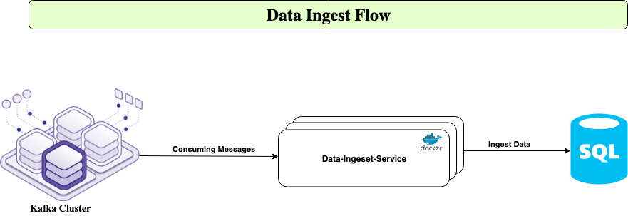

### Introduction
This is patient-activities-ingest is micro service application to compute kafka messages and ingest data into destination database.

### Getting Started
To set up, build and run poc application in LOCAL environment.
1.	Clone or download from TFS (http://dc1-tfs-1:8080/tfs/bi_projects/Kafka%20Data%20Pipeline/Kafka%20Data%20Pipeline%20Team/_versionControl?path=%24%2FKafka%20Data%20Pipeline&version=T&_a=contents)
2.	Open Project patient-activities-ingest in IntelliJ/Eclipse
3.  For lombok plugin configuration please follow steps https://www.baeldung.com/lombok-ide
3.	Build ``` ./gradlew clean build ```
4.	Run the application by right click  PatientActivitiesIngestApp class
    OR using gradle command  ``` ./gradlew bootRun ```

### Endpoint Information
Swagger Documentation : http://localhost:8087/swagger-ui.html
- Health Check:
```
 create data points for data ingest :
    GET -> http://localhost:8087/patientactivities/heartbeat
    Headers -> "Content-Type":"application/json"
               "Accept-Charset":"UTF-8"
```
### Architecture flow for patient-activities-ingest
## 

### Jar file execution option 2 run application
 - Open command line prompt
 - Go to (cd to) project folder
 - Go to build/libs directory
 - execute command  ``` java -jar patient-activities-ingest.jar ```
 - http://localhost:8087/swagger-ui.html

### Docker Option 2 run application
 - To build docker image from docker file
   ``` docker build -t patient-activities-ingest .```
 - To run created docker image  ``` docker run -p 8087:8087 -t patient-activities-ingest ```
 - http://localhost:8087/swagger-ui.html

### Contribute
Ravi Reddy (Ravinder Nancherla)

### License
@CopyRight ( C ) All rights reserved to CDI. It's Illegal to reproduce this code.
