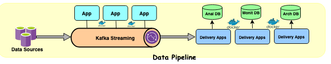
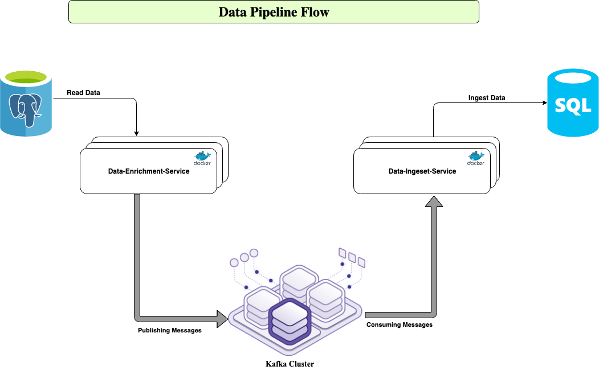

## 
Data pipeline concept is design and structure of code and systems that copy, cleanse or transform as needed, and route source data to destination systems such as data warehouses and data lakes.A reliable data pipeline with built-in auditing, logging, and validation mechanisms helps ensure data quality.

### Data pipeline technologies and techniques
Data pipeline technology is especially helpful for
1. Generate, rely on, or store large amounts or multiple sources of data.
2. Maintain siloed data sources.
3. Require real-time or highly sophisticated data analysis.
4. Store data in the cloud.

#### Techniques and Implementation
1. Micro services architecture patterns (Micro services should be defined based on business process and scalable independently)
2. Kafka Streaming (For event and async communication between the micro services)
3. RDBMS for transactional data, NoSQL for non transactional data
4. Monitoring

#### Technologies
1. SpringBoot(Micro Services)
2. NoSQL (MongoDB, Elastic Search - ELK Stack, Cassandra and more.. based on the need)
3. Postgres and more.
4. Kafka for streaming (event driven pattern)
5. Kibana (Monitoring dash board)
6. ELK stack tools to stream application log data for monitoring

### Architecture flow for data-ingest-service
## 
